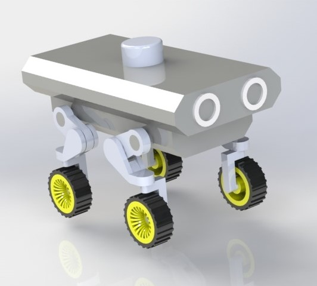

# Overview
This repository contains the source code and CAD files for a **Design and Simulation of a Mobile Robot with ROS2**.This project involves the design of a mobile robot equipped with LIDAR, the use of SolidWorks to create a 3D model, programming a proportional controller script in Python within the ROS2 framework for navigation, and conducting simulations using the Gazebo environment to validate the robot's functionality.
<br>

<br>
## Installation
Follow these instructions to get a copy of the project up and running on your local machine for development and testing purposes.
1. Create a directory with a subfolder named **src** on your local machine.
2. Navigate into the directory using Terminal and run:
```
colcon build
```
This will convert your directory into a ROS2 Workspace

3. Navigate to the src folder and clone the repository to your local machine:
```
git clone https://github.com/Abhey16/Design-and-Simulation-of-a-Mobile-Robot-with-ROS2.git
```
This will add ROS package in the **src** folder. Remember to add only the package not the CAD files(which are provided only for reference)

4. Navigate to the root of ROS2 directory and build the project using colcon:
```
colcon build
```
5. Source the environment to set up the necessary ROS2 variables:
```
source install/setup.bash
```
6. Now launch the Gazebo environment
```
ros2 launch mobile_robot gazebo.launch.py
```
7. For teleop script run:
```
ros2 run mobile_robot teleop.py   
```
8. For Contoller script (commanding the robot to move to a particular point in space) run:
```
ros2 run mobile_robot robotControl.py
```

